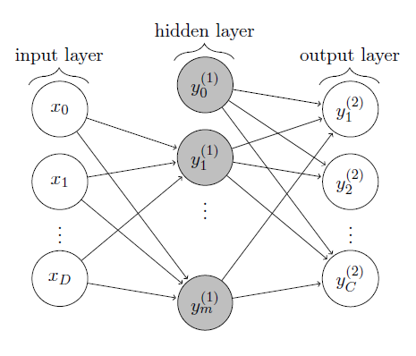
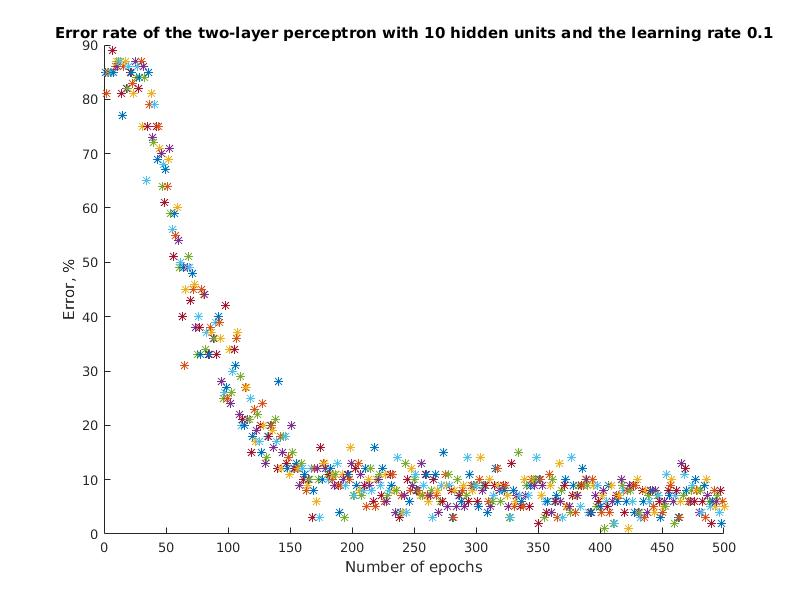
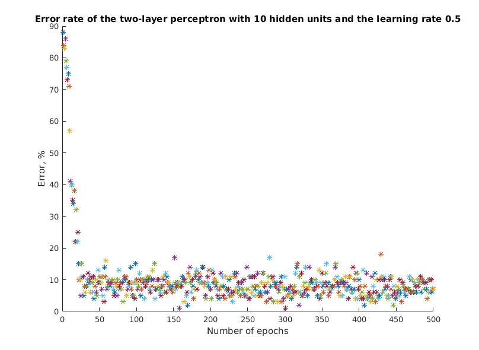
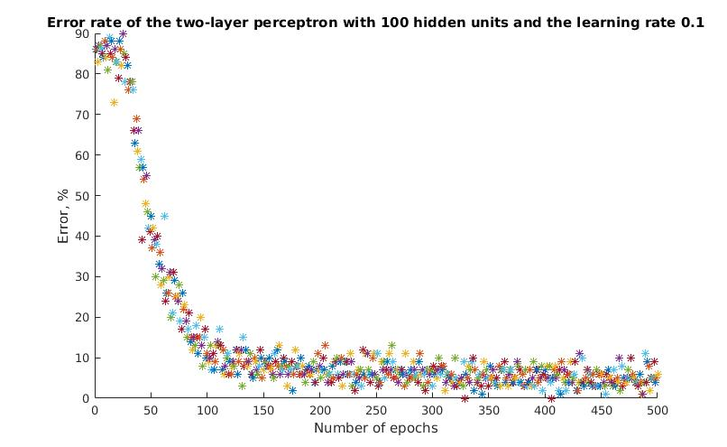
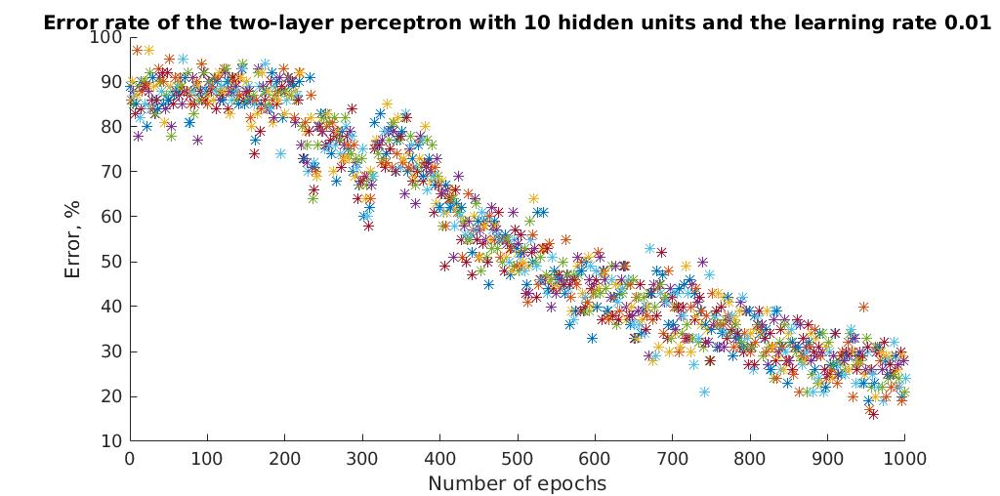
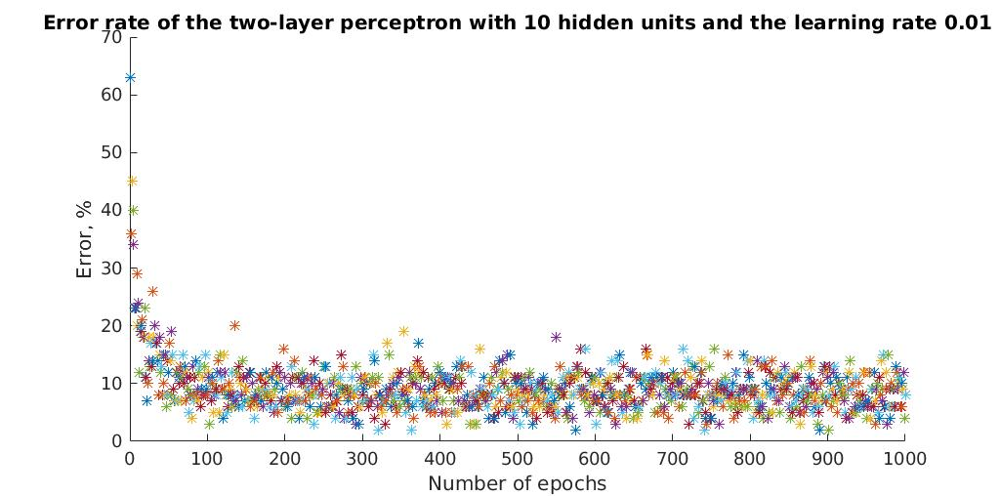
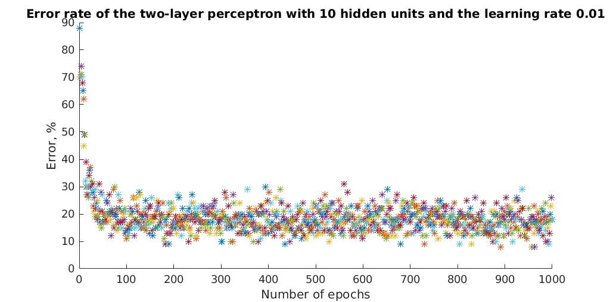

# Recognizing Handwritten Digits using a Two-layer Perceptron

## *Disclaimer* 
I forked this project just to have an easily-accessible, clear, compact and well-commented code showing the basic ideas underlying neural networks. The original code was rewritten, reorganized, patched by comments. The original project was turned into a compact and comfortable sandbox to play with simple, but covering essentials, neural networks.

## Intro

Recognizing the handwritten digits is one of the standard problems that can be easily solved with neural networks. 

The code in this repo is just an implementation of a pretty simple neural network (two-layer perceptron) that can recognize handwritten digits. As a dataset we use the [MNIST](http://yann.lecun.com/exdb/mnist/). The topology of the network is shown on the following picture. We have an input layer, one hidden layer and the output layer. All the neurons' weights are stored in arrays. 

## MNIST Dataset

The [MNIST dataset](http://yann.lecun.com/exdb/mnist/) provides a training set of 60,000 handwritten digits and a validation set of 10,000 handwritten digits. The images have size 28 x 28 pixels. Therefore, when using a two-layer perceptron, we need 28 x 28 = 784 input units and 10 output units (representing the 10 different digits).

The methods `loadMNISTImages` and `loadMNISTLaels` are used to load the MNIST dataset as it is stored in a special file format. The methods can be found online at [http://ufldl.stanford.edu/wiki/index.php/Using_the_MNIST_Dataset](http://ufldl.stanford.edu/wiki/index.php/Using_the_MNIST_Dataset).

## Usage

The entrance point is the script `applyTwoLayerPerceptronMNIST.m`, which trains and evaluates the performance of a two-layer perceptron. All the external parameters are initialized at the very beginning of this script. They include:

1. the number of hidden neurons `numberOfHiddenUnits`;
2. the learning rate `learningRate`;
3. the type of activation functions `activationFunction`, `dActivationFunction`;
4. the batch size `batchSize` and the number of epoch `epoch`.

All the parameters are assigned with some default values providing pretty good results (10% error).

[The original repository](https://github.com/davidstutz/matlab-mnist-two-layer-perceptron) was forked, because, in my opinion, the performance check, choosing the data for training and several other aspects are debatable. Also the comments are not very clear. I will implement all the changes in this fork.

## Some results

### Sigmoid

It seems like the best values for parameters (for the logistic sigmoid activation function) are:

1. weights are initialized with values in range [0, 1]; 
2. the number of hidden neurons `numberOfHiddenUnits` - 10;
3. the learning rate `learningRate` - 0.1;
3. the number of epoch `epoch` - 200.

Notice that increasing the learning rate speeds up the converging (on the following plots we demonstrate the learning rates 0.1 and 0.5), but slightly decreases the eventual error rate (5% and 7% respectively). Also increasing the number of hidden unites over 10 does not seem to have a noticeable effect on the performance. As an illustration we provide a plot of the error rate for 100 hidden units.

### Other activation functions

It turns out that in order to use [other activation functions](https://en.wikipedia.org/wiki/Activation_function) we need to initialize weights with values in range [-1,1] and choose the learning rate to be 0.01. Otherways the network is not converging. See below the results.

*Sigmoid activation function.*

*Sin activation function.*

*ReLU activation function.*

## TODO

1. ~~Minimize the number of files.~~
2. ~~Change the way of selecting input data for training. The current version might use the same sample several times.~~
3. Check validation procedure.
4. ~~Optimize the default parameters.~~
