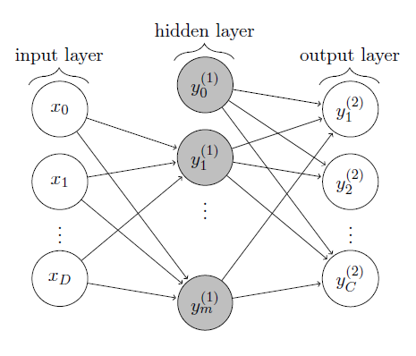

# Recognizing Handwritten Digits using a Two-layer Perceptron

Recognizing the handwritten digits is one of the standard problems that can be easily solved with neural networks. 

The purpose of the code located in this repo is to use a pretty simple neural network (two-layer perceptron) to solve this problem. As a dataset we use the [MNIST](http://yann.lecun.com/exdb/mnist/). The topology of the network is shown on the following picture. We have an input layer, one hidden layer and the output layer. All the layers are coded as arrays. 

## MNIST Dataset

The [MNIST dataset](http://yann.lecun.com/exdb/mnist/) provides a training set of 60,000 handwritten digits and a validation set of 10,000 handwritten digits. The images have size 28 x 28 pixels. Therefore, when using a two-layer perceptron, we need 28 x 28 = 784 input units and 10 output units (representing the 10 different digits).

The methods `loadMNISTImages` and `loadMNISTLaels` are used to load the MNIST dataset as it is stored in a special file format. The methods can be found online at [http://ufldl.stanford.edu/wiki/index.php/Using_the_MNIST_Dataset](http://ufldl.stanford.edu/wiki/index.php/Using_the_MNIST_Dataset).

## Usage

Script `applyTwoLayerPerceptronMNIST.m` trains and evaluates the performance of a two-layer perceptron. There are several parameters in this script, such as the number of hidden neurons `numberOfHiddenUnits`, the learning rate `learningRate`, the type of activation functions `activationFunction`, `dActivationFunction`, the batch size `batchSize` and the number of epoch `epoch`. All the parameters are assigned with some default values providing pretty good results (10% error).

[The original repository](https://github.com/davidstutz/matlab-mnist-two-layer-perceptron) was forked, because, in my opinion, the performance check, choosing the data for training and several other aspects are debatable. Also the comments are not very clear. I will implement all the changes in this fork.

## TODO

1. Minimize the number of files.
2. Change the way of selecting input data. The current version might use the same data several times.
3. Check validation procedure
4. Optimize the default parameters
